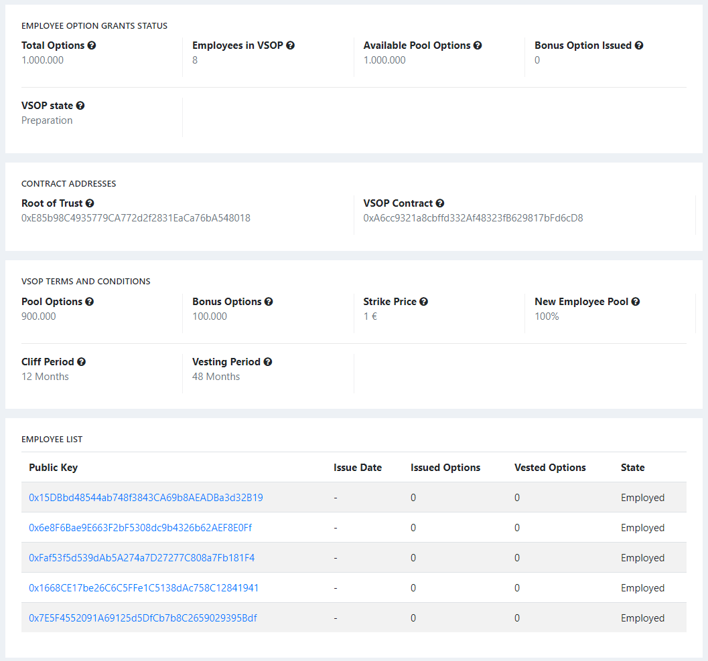
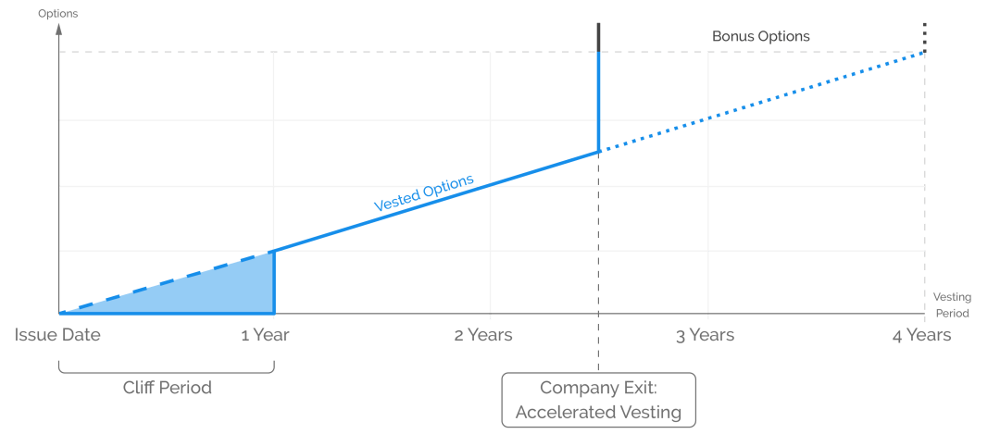

# VSOP Contract
A VSOP (Virtual Share Option Plan) is a profit sharing scheme that enables team members to participate in increasing the value of the company. Profit sharing offers numerous advantages and blockchain-based implementation is also able to overcome disadvantages of traditional programs.

UnitedCrowd will therefore implement its own tokenized VSOP, which we will launch in early February 2020. This article explains how our program works and the advantages we offer our team members.

## UnitedCrowd VSOP: Tokenized profit sharing for our team
UnitedCrowd implements a profit sharing scheme to enable current and future employees, freelancers, advisory boards and consultants to participate in our economic success. This gives our team the opportunity to participate in the future increase in company value. For this purpose, UnitedCrowd offers its team members the opportunity to receive virtual options that grant a share in the proceeds from the exit in the event of an exit (tokenized virtual profit sharing). The granting of virtual options has no influence on the calculation of possible bonus payments, pension plans or other remuneration.

In contrast to a traditional “real” option program, the virtual options do not grant the right to take over company shares when they are exercised, but a contractual right to payment of a certain amount of money. The assertion of this claim is possible in the event of an exit and is referred to as exercise. For this purpose, the partners provide part of their respective exit proceeds and profit distributions.

## Offer and distribution of virtual options
UnitedCrowd may voluntarily offer virtual options to team members, partners, or others who contribute to the company's success through a subscription form. This form is connected to the Ethereum network and enables the beneficiary to accept the offer by signing our VSOP Smart Contract with their private key.

A total number of virtual options, the so-called pool, was defined for distribution to our team. A team member receives a certain percentage of this pool. Options that were distributed to team members are removed from the pool. The number of options a team member receives depends on how long they have been participating in the program or have been part of the UnitedCrowd team. Because: The more employees have already received options, the smaller the pool and the lower the total number of options, from which the percentage of a new employee is calculated. Employees who have supported UnitedCrowd for a long time now have more options than new team members.

## Vesting
The virtual options issued are subject to an exercise mechanism, i.e. an algorithm that determines how many of the options an employee has been given can be exercised. Options that can be exercised are called “vested”.

Immediately after options are issued to an employee, all options remain blocked for a certain period of time (cliff period). At the end of the cliff period, the proportion of exercisable options that a team member has increases linearly monthly at the end of the last day of the month until all options can be exercised. If a team member leaves UnitedCrowd before their options are fully vested, they will retain the portion that is already exercisable at that time. The options that have not yet been vested are returned to the VSOP pool. However, this does not apply if the contract with the team member is terminated for reasons for which it is responsible, such as misconduct. Such an event is known as a “bad leaver event”. At a bad leaver event, all options that the team member has expire and return to the pool.

## Exit - the exercise event
Options grant their owners a right to payment of a certain amount of money. This claim can be asserted when an exit occurs, which is therefore also called the exercise event. Such an exercise event occurs when one of the following conditions is met:

1. A sale and transfer of a total of over 50% of the shares in the company in the context of one or more related transactions ("share deal exit"),

2. A tokenization and the transfer of a total of over 50% of the shares in the company in the context of one or more related transactions through a token offer ("STO") ("Share Deal Exit"),

3. A sale and transfer of all material assets of the company in the context of one or more related transactions ("asset deal exit"),

4. A listing of the company on the stock exchange ("IPO exit"),

5. An effective resolution of the general meeting to carry out a profit distribution / dividend higher than EUR 1,000,000 for a previous financial year.

There is no exercise event according to 1., 2. or 3. if it is an exchange, contribution or merger within the meaning of the Transformation Act and the shareholders still more than 50% of the shares in the continuing company after this process hold.

## Exercise notification and exercise period
If an exercise event occurs, we will inform our team members at least two weeks before the exit with an exercise notification. This notification includes an offer to the team member to sign an exercise smart contract with their private key (the exercise offer). The offer is made via an exit form that is connected to the Ethereum blockchain. The conditions for exercising are specified in the exit form. The team member can accept the offer within two weeks by signing it with their private key. His options will then be exercised on the terms set. If he does not accept the offer, UnitedCrowd has the right to exercise the options himself.

Payment after exercise
After exercising the virtual options, the VSOP participant has a payment claim against UnitedCrowd, which is calculated as follows:

Z = A x (E - B)

where applies

Z = (payment) entitlement to payment of the beneficiary;

A = (number of options) number of virtual options exercised by the beneficiary;

B = (base price) The base price per virtual option is EUR 1.

E = (Exiting proceeds or profit distribution proportion) The proportionate Exiting proceeds or profit distribution proportion attributable to each virtual option

(i) corresponds to the issue price for an IPO exit;

(ii) is calculated for a share deal exit and an asset deal exit using the following formula:

E = (e - k - p - b) / (s + o)

where applies

e = (proceeds) The purchase price paid to the shareholders in the case of a share deal exit or in the case of an asset deal exit in the case of a fictitious exit of the company for distribution to the shareholders, taking into account any deposit amounts (escrows), Purchase price retention and / or purchase price adjustments;

k = (costs) The costs borne by the partners for consultants and other transaction costs;

p = (Preferences) The liquidation, proceeds and similar preferences to be paid to priority according to the relevant shareholders' agreement or the articles of association;

b = (debt relief certificates) The payments due to existing debt relief certificates or comparable contractual agreements in the event of an exercise event to be made to certain persons;

s = (share capital) The amount of the (sold) nominal capital of the company at the time of the exercise event;

o = (Options) The number of virtual options saved and entitled to payment by all those entitled to options.

_Note: The calculation of the exit proceeds or profit distribution share treats the option beneficiaries in the context of the exit transaction or profit distribution as if they had held / sold company shares themselves, or as holders of company shares were to participate in the sales proceeds / profit distribution. In this respect, the nominal capital has to be increased by the number of virtual options entitled to pay (so-called fully diluted consideration) and, on the other hand, revenue preferences to be paid to certain shareholders as well as benefits on the basis of debt recovery certificates._

## Sale and inheritance of options
The options issued under the VSOP are not transferable without UnitedCrowd's prior written consent. If options are transferred without prior approval, they expire without compensation. However, options can be inherited.

## Capital increase and capital decrease
The options issued are not subject to a dilution protection mechanism, for example in the event of a capital increase by the company. In the event of a capital reduction by pooling shares without repayment of capital, the number of options issued is reduced proportionately in accordance with the capital reduction.

## Tokenized VSOP - also for your company
UnitedCrowd offers companies the opportunity to easily implement profit sharing programs with tokenized virtual shares.

For this purpose, we will provide everything on our platform that companies need to implement a VSOP - unbureaucratic, clear and adaptable.

## Function list

Function | Description
---------|------------
distributeAndReturnToPool() | enumerates all employees that were offered poolOptions after than fromIdx -1 employee
removeEmployeesWithExpiredSignaturesAndReturnFadeout() | removes employees from vsop with expired signup
setCompanyDetails() | sets all company detail parameters (`companyName`; `companyCity`; `companyCountry`; `companyRegisterNumber`;)
setLegalDetails() | sets legal parameters (`courtCity`; `courtCountry`)
setCodeDetails() | sets code parameters (`repoURL`; `commitId`)
openESOP() | Init VSOP
offerOptionsToEmployee() | Options calculations bib
increaseEmployeeExtraOptions() | increases amount of bonus options of employee; requires `EmployeeState`
employeeSignsToESOP() | finalizing signup; requires `emp.state == EmployeeState.WaitingForSignature`
toggleEmployeeSuspension() | handels good- and bad leaver events; requires `emp.state == EmployeeState.Employed`
terminateEmployee() | terminates vesting applies; good leaver events; bad leaver events; calculation of options and bonus (`remainingPoolOptions`; `totalExtraOptions`)
offerOptionsConversion() | is being called before options conversion contract to prevent re-entry; burns options; exercise options in the name of employee and assign those to `exerciseFor`

- Contract requires `BaseOptionsConverter.sol`, `OptionsCalculator.sol`, `EmployeesList.sol`, 'ESOPTypes.sol`
- Contract based on `solidity ^0.4.26`

